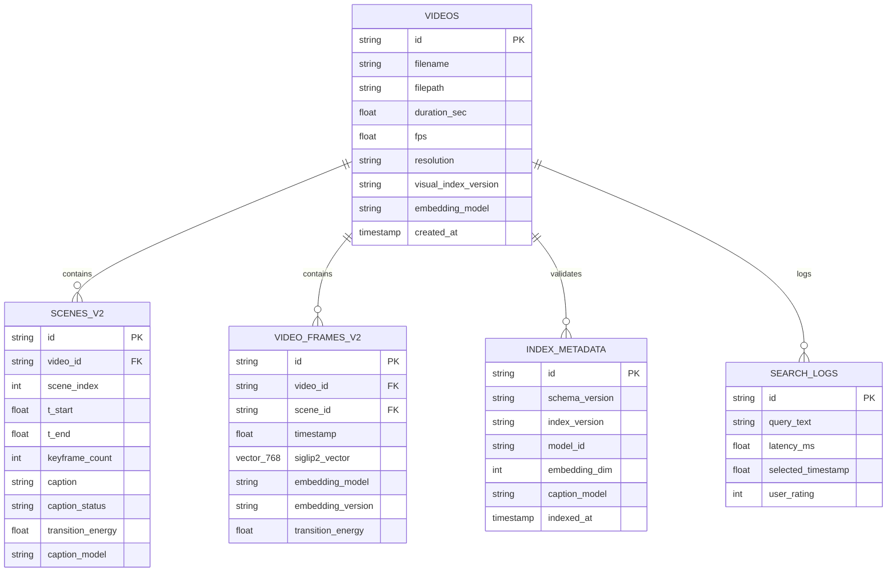

# ข้อเสนอโครงงานวิจัยระดับปริญญาตรี (Senior Project Proposal)

**ชื่อโครงงาน (ภาษาไทย):** ระบบสืบค้นและระบุช่วงเวลาในวิดีโอด้วยภาษาธรรมชาติแบบไฮบริดหลายมิติ  
**ชื่อโครงงาน (ภาษาอังกฤษ):** Pure-Visual Video Moment Retrieval and Temporal Localization System
**สาขาวิชา:** วิทยาการคอมพิวเตอร์ / วิศวกรรมคอมพิวเตอร์ / ปัญญาประดิษฐ์และวิทยาศาสตร์ข้อมูล  

---

## 1. ที่มาและความสำคัญของโครงงาน (Rationale and Background)

### 1.1 ความเป็นมาและปัญหาของงานวิจัย (Problem Statement)
ในยุคดิจิทัลปัจจุบัน ปริมาณข้อมูลวิดีโอความยาวสูง (Long-form Video) เติบโตขึ้นอย่างก้าวกระโดดในทุกภาคส่วน เช่น วิดีโอบันทึกการเรียนการสอน (Lecture & Presentation Recordings), วิดีโอบันทึกการประชุม (Meeting Archives), ฟุตเทจงานตัดต่อสื่อมีเดีย (Media Production), ตลอดจนวิดีโอบันทึกเหตุการณ์จากกล้องวงจรปิดและกล้องหน้ารถ (Surveillance & Dashcam Footage) อย่างไรก็ตาม ปัญหาคอขวดสำคัญที่ผู้ใช้งานต้องเผชิญคือ **"ภาระในการค้นหาและระบุตำแหน่งช่วงเวลาที่เกิดเหตุการณ์เฉพาะเจาะจง" (Data Overload and Manual Video Scrubbing)** ซึ่งผู้ใช้งานต้องเสียเวลาเปิดดูและเลื่อนแถบเวลา (Time Bar) ยาวนานหลายสิบนาทีหรือหลายชั่วโมงเพื่อหาช่วงเวลาสั้น ๆ เพียงไม่กี่วินาที

ระบบสืบค้นวิดีโอแบบดั้งเดิมส่วนใหญ่ยังคงพึ่งพาคำกำกับข้อมูลภายนอก (Metadata) เช่น ชื่อไฟล์ แท็ก หรือคำอธิบายภาพรวม ซึ่งไม่สามารถเข้าถึงเนื้อหาเชิงลึกในระดับช่วงเวลา (Fine-grained Temporal Content) และไม่เข้าใจคำค้นหาภาษาธรรมชาติที่ซับซ้อน เช่น:
* *"ช่วงที่อาจารย์เริ่มอธิบายกราฟแท่งเปรียบเทียบผลลัพธ์โมเดล"* (เกี่ยวข้องกับทั้งภาพสไลด์และเสียงพูด)
* *"ตอนที่มีคนสวมเสื้อสีแดงเดินเข้ามาหยิบกระเป๋าบนโต๊ะ"* (เกี่ยวข้องกับกิจกรรมและปฏิสัมพันธ์ของวัตถุ)
* *"ฉากที่รถจักรยานยนต์เลี้ยวตัดหน้ากะทันหันก่อนถึงทางแยก"* (เกี่ยวข้องกับเหตุการณ์เชิงการกระทำฉับพลัน)

ในช่วงปี 2025–2026 งานด้าน video moment retrieval มีเครื่องมือ visual-language ที่เหมาะกับการทำงานแบบ local มากขึ้น งานนี้จึงเลือกใช้เฉพาะข้อมูลภาพและคำบรรยายฉากจากภาพ โดยไม่ตีความเสียงหรือข้อความบนภาพเป็นหลักฐาน:
1. **`SigLIP 2` (Google DeepMind, 2025):** โมเดล Vision-Language Encoder เจเนอเรชันใหม่ที่ผสานการฝึกแบบ Masked Prediction, Self-Distillation และรองรับ **NaFlex (Native Flexible Dynamic Resolution)** ทำให้เข้าใจตำแหน่งเชิงพื้นที่ (Spatial Awareness) และรายละเอียดภาพวิดีโออัตราส่วน 16:9 ได้เหนือกว่า CLIP และ SigLIP 1 อย่างก้าวกระโดด
2. **`Qwen2.5-VL-7B` (Alibaba Cloud):** โมเดลภาษาภาพสำหรับสร้าง dense visual scene captions และตรวจสอบลำดับการกระทำในโหมด Accurate โดย prompt จำกัดเฉพาะวัตถุ การกระทำ และการเปลี่ยนสถานะ
3. **`Decord` (GPU-Accelerated Video Decoding):** ไลบรารีอ่านเฟรมวิดีโอสำหรับการสร้างดัชนีและการตรวจสอบช่วงเวลา
4. **`LanceDB` (Serverless Columnar Vector Database):** ฐานข้อมูลเวกเตอร์แบบฝังตัวสำหรับ frame embeddings และ full-text search ของ scene captions

โครงงานนี้จึงนำเสนอ **ระบบสืบค้นและระบุตำแหน่งช่วงเวลาในวิดีโอแบบ Pure-Visual** ที่รวม frame embeddings, dense visual scene captions, multi-scale temporal proposals, RRF และ calibrated scoring เพื่อระบุช่วงเวลา $[t_{start}, t_{end}]$ บนเครื่อง local โดยรักษา timeline และรองรับหลายเหตุการณ์ที่ไม่ทับซ้อนกัน

---

### 1.2 คำถามวิจัยและสมมติฐาน (Research Questions & Hypotheses)

* **คำถามวิจัยที่ 1 (RQ1 - NaFlex Visual Embedding vs Legacy):** การประยุกต์ใช้โมเดล `SigLIP 2` (Dynamic Resolution NaFlex) จะช่วยเพิ่มความแม่นยำในการสืบค้นระดับเฟรมและช่วงเวลา ($R@1@\text{IoU}=0.5$) สูงกว่า `SigLIP 1` และ `CLIP` ดั้งเดิมอย่างมีนัยสำคัญทางสถิติหรือไม่ ($p < 0.05$)?
  * *สมมติฐาน (H1):* ด้วยกลไก Masked Prediction และ NaFlex ของ SigLIP 2 จะช่วยเพิ่มค่า $R@1@\text{IoU}=0.5$ ได้สูงขึ้นไม่น้อยกว่า $+12\%$ เมื่อเทียบกับ SigLIP 1
* **คำถามวิจัยที่ 2 (RQ2 - Pure-Visual Hybrid Fusion Impact):** การผสาน frame similarity กับ dense visual scene-caption BM25 ผ่าน RRF และ multi-scale temporal proposals จะช่วยลดความคลาดเคลื่อนเวลา ($\Delta t_{start}$) และเพิ่มค่า Mean IoU ($\text{mIoU}$) เหนือ visual-only baseline ได้หรือไม่?
  * *สมมติฐาน (H2):* fusion ที่ผ่านการ tune และ calibration จะเพิ่ม R@1 และ mIoU บน held-out test อย่างมีนัยสำคัญ โดยตัวเลขต้องรายงานจาก benchmark จริงเท่านั้น
* **คำถามวิจัยที่ 3 (RQ3 - Ingestion Throughput & Storage Efficiency):** การใช้ `Decord (GPU Decoding)` ควบคู่กับ `LanceDB (Apache Arrow)` และโมเดล Quantized Qwen2.5-VL จะสามารถเร่งความเร็วการทำดัชนีให้อยู่ในระดับ $\text{RTF} \le 0.15$ (วิดีโอ 1 ชม. ทำดัชนีเสร็จใน $\le 9$ นาที) ภายใต้หน่วยความจำ GPU $\le 7.0\text{ GB}$ ได้หรือไม่?
  * *สมมติฐาน (H3):* Decord และ LanceDB จะลดเวลา Ingestion Latency ลงได้มากกว่า 60% เมื่อเทียบกับสถาปัตยกรรม CPU OpenCV + Traditional Vector DB โดยผู้ใช้เริ่มค้นหาได้ใน Phase 1 ภายในเวลาไม่เกิน 45–60 วินาที

---

## 2. วัตถุประสงค์ของโครงงาน (Objectives)

1. **เพื่อออกแบบและพัฒนาระบบสกัดข้อมูลวิดีโอเร่งความเร็วด้วยฮาร์ดแวร์ (Hardware-Accelerated Progressive Ingestion Pipeline)** โดยใช้ `Decord` สำหรับการถอดรหัสวิดีโอบน GPU ควบคู่กับการตัดแบ่งฉากและคีย์เฟรมอย่างปรับตัว (Adaptive SSIM Filtering)
2. **เพื่อประยุกต์ใช้ visual-language models แบบ local** ได้แก่ `SigLIP 2 NaFlex` สำหรับ frame/text embeddings และ `Qwen2.5-VL-7B` (4-bit เมื่อเหมาะสม) สำหรับ dense visual captions และ Accurate visual verification
3. **เพื่อพัฒนาฐานข้อมูลเวกเตอร์และระบบสืบค้นประสิทธิภาพสูง (Serverless Columnar Vector Database)** โดยใช้ `LanceDB` จัดเก็บเวกเตอร์แบบ Zero-Copy บน Apache Arrow ร่วมกับดัชนี Disk-based IVF-PQ และ Full-Text Search (Tantivy FTS)
4. **เพื่อพัฒนาระบบคำนวณและจัดกลุ่มช่วงเวลาเหตุการณ์ (Temporal Boundary Localization & Smoothing Engine)** ที่ผสานคะแนนผ่าน Reciprocal Rank Fusion (RRF) และ 1D Gaussian Convolution เพื่อระบุขอบเขตเวลา $[t_{start}, t_{end}]$ ได้อย่างแม่นยำ
5. **เพื่อพัฒนาเว็บแอปพลิเคชันต้นแบบ (Full-Stack Modern Web Application)** ด้วย Next.js 14+ และ FastAPI ที่มีแถบแสดงความหนาแน่นของความเกี่ยวข้อง (Relevance Heatmap), Moment Cards, และ Custom Video Player ที่ Seek ไปยังช่วงเวลาเป้าหมายอัตโนมัติ
6. **เพื่อประเมินประสิทธิภาพของระบบอย่างเป็นระบบ (Comprehensive Evaluation & Ablation Study)** ทั้งบนชุดข้อมูลมาตรฐานสากล (QVHighlights / Charades-STA), ชุดข้อมูลสถานการณ์จริง 30 ชั่วโมง, และการทดสอบกับผู้ใช้งานจริง (Task Completion Time & SUS Score)

---

## 3. ขอบเขตของโครงงาน (Scope of Work)

### 3.1 ขอบเขตด้านข้อมูลนำเข้าและการประมวลผล (Data Ingestion & Hardware Acceleration)
* **รูปแบบไฟล์ที่รองรับ:** `.mp4`, `.mkv`, `.mov`, `.webm` ความละเอียดตั้งแต่ HD (720p) ถึง 4K (2160p) อัตราเฟรม 24–60 fps
* **การถอดรหัสวิดีโอ:** ใช้ไลบรารี **`Decord`** ถอดรหัสผ่านชิปฮาร์ดแวร์ NVIDIA NVDEC (GPU Video Acceleration) เพื่อดึงเฟรมภาพความเร็วสูงโดยตรงเข้าสู่ GPU Memory (VRAM)
* **ประเภทเนื้อหาวิดีโอที่ครอบคลุม:**
  1. *Lectures & Presentations:* วิดีโอการเรียนการสอนและสไลด์ โดยใช้เฉพาะสิ่งที่มองเห็นและการเปลี่ยนแปลงในเฟรม
  2. *Meetings & Discussions:* วิดีโอการประชุมและการแชร์หน้าจอ โดยไม่ใช้เสียงหรือข้อความบนภาพเป็นหลักฐาน
  3. *CCTV & Dashcam Driving:* ฟุตเทจกล้องวงจรปิด/กล้องหน้ารถ เน้นการตรวจจับวัตถุและเหตุการณ์ฉับพลัน
* **การแบ่งส่วนฉากและการสกัดคีย์เฟรม:** ใช้ `PySceneDetect` (Adaptive Detector) ร่วมกับ `TransNetV2` และคำนวณค่า Structural Similarity Index (SSIM) ระหว่างเฟรมเพื่อตัดเฟรมที่ซ้ำซ้อนออกมากกว่า 75%

### 3.2 ขอบเขตด้านโมเดลปัญญาประดิษฐ์ (Pure-Visual Model Stack)
* **โมเดลเวกเตอร์ภาพและข้อความ:** **`google/siglip2-base-patch16-naflex`** สกัด frame embeddings โดยรักษา aspect ratio และรับ query ภาษาไทย/อังกฤษโดยตรง
* **โมเดลภาษาภาพ:** **`Qwen2.5-VL-7B-Instruct`** (4-bit ตาม memory budget) ทำ dense visual scene captions และตรวจสอบ action/boundary ใน Accurate mode โดยห้ามอ้างอิงเสียงหรือข้อความบนภาพ

### 3.3 ขอบเขตด้านฐานข้อมูลและการสืบค้น (Database & Retrieval Engine)
* **ฐานข้อมูลเวกเตอร์:** **`LanceDB`** (Serverless, Embedded Columnar Storage บน Apache Arrow Format)
* **ดัชนีเวกเตอร์:** Disk-based **IVF-PQ (Inverted File with Product Quantization)** ค้นหา Approximate Nearest Neighbor (ANN) ด้วยความเร็วระดับ $< 5\text{ ms}$
* **ดัชนีข้อความ:** LanceDB Full-Text Search (BM25) สำหรับ scene captions ที่สร้างสำเร็จเท่านั้น
* **อัลกอริทึมการผสานคะแนน:** Tuned Reciprocal Rank Fusion (RRF) ระหว่าง visual rank และ caption rank ร่วมกับ multi-scale temporal proposals และ Platt calibration

### 3.4 ขอบเขตด้านสถาปัตยกรรมซอฟต์แวร์ (Software Stack & UI)
* **Backend:** Python 3.11+, FastAPI (REST API, WebSocket, HTTP Range Byte-Streaming), Decord, LanceDB, PyTorch 2.x
* **Background Queue:** Asynchronous Task Pipeline (FastAPI BackgroundTasks / Redis + Celery)
* **Frontend:** Next.js 14+ (App Router, React 18/19, TypeScript), Tailwind CSS, Lucide React Icons
* **Video Control:** Custom HTML5 Video Player API พร้อม Dynamic Relevance Heatmap Bar และ Interactive Segment Range Markers
* **การติดตั้งและทำงาน:** Local On-Premise Execution รองรับ Windows 11 และ Linux (Ubuntu 22.04+)

### 3.5 ข้อจำกัดของโครงงาน (Limitations)
* ระบบเป็นรูปแบบ **Progressive Ingestion**: สร้าง frame embeddings ก่อน แล้วสร้าง scene captions เป็นงานเสริมแบบ background จึงค้นหาได้แม้ caption ยัง unavailable
* คุณภาพขึ้นอยู่กับความคมชัด อัตราการเปลี่ยนฉาก และการมองเห็นวัตถุ หากภาพมืด เบลอ หรือเหตุการณ์อยู่นอกเฟรม ความแม่นยำอาจลดลง

---

## 4. ทฤษฎีและงานวิจัยที่เกี่ยวข้อง (Theoretical Background & Literature Review)

### 4.1 วิวัฒนาการของ Video Moment Retrieval (VMR)
งานวิจัยดั้งเดิมด้าน Temporal Video Grounding (เช่น TALL [Gao et al., 2017] และ 2D-TAN [Zhang et al., 2020]) ใช้การ Train โมเดลเฉพาะทางบนชุดข้อมูลปิด ปัจจุบันวงการวิจัยได้เปลี่ยนผ่านสู่ **Zero-Shot / Open-Vocabulary Video Retrieval** โดยอาศัย Foundation Models ที่ได้รับการฝึกฝนบนข้อมูลขนาดใหญ่ ทำให้รองรับคำค้นหาภาษาธรรมชาติได้อย่างอิสระโดยไม่ต้องเทรนโมเดลใหม่

### 4.2 สถาปัตยกรรม SigLIP 2 และ NaFlex Dynamic Resolution
SigLIP 2 (Google DeepMind, 2025) พัฒนาต่อยอดจาก SigLIP 1 (Zhai et al., 2023) โดยเพิ่มกระบวนการฝึก 3 ด้าน:
1. **Pairwise Sigmoid Loss:** ป้องกันปัญหา Softmax Normalization ข้าม Global Batch:
   $$\mathcal{L}_{SigLIP2} = -\sum_{i,j} \left( y_{ij} \log \sigma(t \cdot \mathbf{u}_i \cdot \mathbf{v}_j + b) + (1 - y_{ij}) \log (1 - \sigma(t \cdot \mathbf{u}_i \cdot \mathbf{v}_j + b)) \right)$$
2. **Masked Prediction & Self-Distillation:** ช่วยให้โมเดลเข้าใจโครงสร้างเชิงพื้นที่ (Spatial Geometry) และความสัมพันธ์ของวัตถุในฉาก
3. **NaFlex (Native Flexible Resolution):** รองรับภาพอัตราส่วนวิดีโอ 16:9 โดยไม่ต้องยืดภาพหรือตัดขอบภาพ (Zero Distortion)

```
SigLIP 2 Architecture & Joint Latent Space:
┌────────────────────────────────────────────────────────────────────────┐
│  Keyframe f_t (16:9) ──► NaFlex Vision Encoder (ViT) ──► v_t ∈ ℝ^768   │
│                                                            ▲           │
│                                                Cosine      │           │
│                                              Similarity    │           │
│                                                            ▼           │
│  Text Query Q        ──► Multilingual Text Encoder   ──► u_q ∈ ℝ^768   │
└────────────────────────────────────────────────────────────────────────┘
```

### 4.3 แบบจำลอง Qwen2.5-VL-7B สำหรับ Visual Temporal Verification
Qwen2.5-VL-7B-Instruct ใช้ในสองงานที่แยกจาก Fast retrieval: สร้าง dense scene captions จากเฟรมจริง และตรวจสอบ top candidates ใน Accurate mode โดยรับ timestamp เป็น metadata และตอบ JSON ที่มี `action_present`, index เฟรมเริ่ม/จบ และ confidence เท่านั้น การประเมินห้ามใช้เสียงหรืออ่านข้อความบนภาพเป็นหลักฐาน และต้องมี time/VRAM guard พร้อม fallback ไปยังผล Fast

### 4.4 สถาปัตยกรรม LanceDB และ Apache Arrow Columnar Storage
LanceDB ใช้รูปแบบไฟล์แบบ **Lance** ซึ่งเป็น Columnar Data Format ที่สร้างขึ้นสำหรับ AI และ Multimodal Data โดยเฉพาะ:
* **Zero-Copy Memory Access:** อ่านข้อมูลเวกเตอร์ผ่านหน่วยความจำโดยตรงผ่าน Apache Arrow
* **Disk-based IVF-PQ Indexing:** จัดกลุ่มเวกเตอร์ (Inverted File) ร่วมกับการบีบอัดเวกเตอร์ (Product Quantization) ทำให้ค้นหาเวกเตอร์นับล้านได้ในเวลา $< 5\text{ ms}$ โดยไม่ต้องโหลดข้อมูลทั้งหมดขึ้น RAM

### 4.5 การผสานคะแนนและการสกัดขอบเขตเวลา (RRF & Multi-Scale Proposals)
1. **Reciprocal Rank Fusion (RRF):**
   $$RRF(d) = \sum_{m \in M} \frac{w_m}{k + r_m(d)}$$
   โดย $M = \{\text{Visual (SigLIP 2)}, \text{Caption (Qwen2.5-VL)}\}$, $k=60$ และน้ำหนักเริ่มต้น visual/caption = 0.80/0.20 ก่อน tune จาก dev split

2. **Raw relevance timeline และ multi-scale proposals:** สร้างคะแนนที่ 2Hz โดยเก็บ raw และ display-normalized timeline แยกกัน แล้วหาจุด local maximum จาก rolling windows 2, 4, 8, 16, 32 วินาที และขยายตามความยาววิดีโอ

3. **Temporal Interval Extraction (การคำนวณช่วงเวลา $[t_{start}, t_{end}]$):**
   $$[t_s, t_e] = \arg\max_{[t_1, t_2]} \int_{t_1}^{t_2} \left( \tilde{\mathcal{S}}(t) - \theta_{dyn} \right) dt \quad \text{where } \theta_{dyn} = \mu_{\mathcal{S}} + \lambda \sigma_{\mathcal{S}}$$

---

## 5. สถาปัตยกรรมระบบและระเบียบวิธีวิจัย (System Architecture & Methodology)

### 5.1 ผังการทำงานภาพรวมของระบบ (Pure-Visual System Architecture)

```text
============================ PROGRESSIVE PURE-VISUAL INGESTION ============================

 [ ไฟล์วิดีโอต้นฉบับ (MP4 / MKV / MOV / WEBM) ]
                    │
        ▼
 [ Decord Video Reader ]
   (สกัดเฟรมตาม scene และ transition)
        │
        ▼
 [ Adaptive Scene & Transition Sampling ]
        │
   ┌────┴─────────────────────────────┐
   ▼                                  ▼
[ SigLIP 2 NaFlex Encoder ]  [ Qwen2.5-VL-7B (4-bit) ]
 (เฟรม embeddings จริง)       (Dense Visual Captions)
   │                                  │
   └──────────────────┬───────────────┘
                      ▼
   ====================================================================
    [ LanceDB Serverless Columnar Vector Database (Apache Arrow) ]
     - Table: videos        (id, filename, duration, fps, status)
     - Table: video_frames_v2 (frame_id, video_id, timestamp, siglip2_vector)
     - Table: scenes_v2 (scene_id, video_id, t_start, t_end, caption, caption_status)
     - Table: index_metadata (schema/model versions, indexed_at)
     - Indexing: vector search & LanceDB BM25/FTS for generated captions
   ====================================================================

================================ REAL-TIME PURE-VISUAL RETRIEVAL ================================

 [ ผู้ใช้ป้อนคำค้นภาษาธรรมชาติ: "ฉากที่มีการสาธิตกราฟโมเดลและคนยกมือถาม" ]
                    │
        ┌───────────┴───────────────────────────────┐
        ▼                                           ▼
 [ SigLIP 2 Text Encoder ]                    [ Caption BM25/FTS ]
   (original + deterministic variants)       (generated scenes only)
        │                                           │
        └──────────────────┬────────────────────────┘
                           ▼
        [ Tuned Visual/Caption RRF + 2Hz Timeline ]
                           │
                           ▼
        [ Multi-Scale Temporal Proposals + Soft-NMS ]
                           │
                           ▼
        [ Platt-Calibrated Probability / No-Match Gate ]
                               │
                               ▼
        [ Temporal Boundary Extraction ([t_start, t_end]) ]
                               │
                               ▼
        [ FastAPI REST / WebSocket Response Payload ]
                               │
                               ▼
        [ Next.js Interactive Video Interface ]
        - Auto-jump / Seek ไปยังจุดเริ่มต้น t_start
        - วาดแถบไฮไลต์ช่วงเวลาเหตุการณ์ (Interactive Timeline Segment)
        - แสดงผล Density Heatmap ความหนาแน่นของความเกี่ยวข้องตลอดทั้งคลิป
```

---

### 5.2 โครงสร้างตารางข้อมูลบน LanceDB (LanceDB Schema Design)



---

### 5.3 สถาปัตยกรรมการประมวลผลสองเฟสแบบก้าวหน้า (Progressive Ingestion Pipeline)

1. **Phase 1: Frame index:** `Decord` อ่านต้น/กลาง/ท้ายฉากและ transition frames ตาม adaptive interval แล้ว `SigLIP 2 NaFlex` สร้าง embedding ของเฟรมจริงลง `video_frames_v2`
2. **Phase 2: Scene captions:** Qwen สร้าง caption ระดับ scene แบบ asynchronous พร้อม `caption_status`; caption ที่ unavailable/error จะไม่เพิ่มคะแนน
3. **Phase 3: Validation:** ตรวจจำนวน record, embedding dimension และ `index_metadata` ก่อนสลับ v2 เป็น active index; v1 ตอบ `409 reindex_required`

---

## 6. ระเบียบวิธีการทดลองและเกณฑ์การวัดผล (Experimental Design & Evaluation)

### 6.1 ชุดข้อมูลที่ใช้ในการทดลอง (Experimental Datasets)

| ประเภทชุดข้อมูล | ชื่อชุดข้อมูล / แหล่งที่มา | จำนวนวิดีโอ / ความยาว | ข้อมูลกำกับ (Annotations) |
| :--- | :--- | :---: | :--- |
| **Standard Academic Benchmark** | **QVHighlights** (Subset) / **Charades-STA** | 200 วิดีโอคลิป (~15 ชม.) | Ground-truth Natural Language Queries พร้อมพิกัดช่วงเวลา $[t_{start}^{GT}, t_{end}^{GT}]$ ตามมาตรฐานสากล |
| **Real-World Domain 1** | **Educational Lectures & Presentations** | 10 ชั่วโมง | วิดีโอบันทึกการสอนและการเปลี่ยนแปลงที่มองเห็นได้ในฉาก |
| **Real-World Domain 2** | **Meeting Archives & Discussions** | 10 ชั่วโมง | วิดีโอการประชุมหลายผู้พูด การแชร์หน้าจอ และกิจกรรมกลุ่ม |
| **Real-World Domain 3** | **CCTV & Dashcam Driving Footage** | 10 ชั่วโมง | ฟุตเทจกล้องวงจรปิด/หน้ารถ เน้นการตรวจจับวัตถุและการกระทำฉับพลัน |

---

### 6.2 ตัวชี้วัดประสิทธิภาพเชิงระบบ (Evaluation Metrics)

| ด้านที่ประเมิน | ตัวชี้วัด (Metric) | นิยาม / สูตรการคำนวณ | ค่าเป้าหมายที่คาดหวัง |
| :--- | :--- | :--- | :---: |
| **ความแม่นยำช่วงเวลา** | **$R@K@\text{IoU} \ge \alpha$** ($K=1, 5; \alpha=0.3, 0.5$) | $R@K@\alpha = \frac{1}{|Q|} \sum_{q \in Q} \mathbb{I}\left( \max_{k \le K} \text{IoU}(S_k, S_{gt}) \ge \alpha \right)$ | $R@1@0.3 \ge 70\%$<br>$R@1@0.5 \ge 55\%$<br>$R@5@0.5 \ge 80\%$ |
| **ความแม่นยำเฉลี่ย** | **Mean IoU (mIoU)** | $\text{mIoU} = \frac{1}{|Q|} \sum_{q=1}^{|Q|} \text{IoU}(S_q^{pred}, S_q^{gt})$ | รายงาน delta จาก baseline จริง |
| **ความคลาดเคลื่อนจุดเริ่มต้น** | **Mean Temporal Error ($\Delta t_{start}$)** | $\Delta t_{start} = \frac{1}{|Q|} \sum |\hat{t}_{start} - t_{start}^{gt}|$ (วินาที) | รายงานจาก held-out test |
| **ความเร็วในการค้นหา** | **Query Latency** | เวลาตั้งแต่กดค้นหาจนได้รับผลลัพธ์ | Fast p95 ≤ 1 s; Accurate p95 ≤ 15 s |
| **ความเร็วในการทำดัชนี** | **Real-Time Factor (RTF)** | $\text{RTF} = \text{Time}_{ingest} / \text{Duration}_{video}$ บน Consumer GPU | $\text{RTF} \le 0.15$ (วิดีโอ 1 ชม. $\le$ 9 นาที) |
| **การใช้ทรัพยากรระบบ** | **Peak GPU VRAM & System RAM** | หน่วยความจำสูงสุดที่ใช้ขณะรัน Ingestion/Query | $\text{VRAM} \le 8$ GB |

---

### 6.3 การทดลองเพื่อเปรียบเทียบประสิทธิภาพเชิงสถาปัตยกรรม (Comprehensive Ablation Study)

```
┌────────────────────────────────────────────────────────────────────────────────────────┐
│                        ตารางแผนการทดลองแบบ Ablation Study 5 รูปแบบ                       │
├─────────────────────┬──────────────────┬─────────────────┬──────────────┬──────────────┤
│ รูปแบบการทดลอง       │ Visual Model     │ Scene Caption   │ Proposals / Calibration │
├─────────────────────┼──────────────────┼─────────────────┼──────────────┼──────────────┤
│ 1. Baseline (CLIP)  │ CLIP ViT-B/32    │ -               │ -            │ No           │
│ 2. SigLIP 1 Only    │ SigLIP 1 Base    │ -               │ -            │ No           │
│ 3. SigLIP 2 Only    │ SigLIP 2 NaFlex  │ -               │ -            │ Yes          │
│ 4. Visual + Caption │ SigLIP 2 NaFlex  │ Qwen2.5-VL-7B   │ RRF + calibrated │
│ 5. Accurate         │ SigLIP 2 NaFlex  │ Qwen verifier   │ RRF + verifier  │
└─────────────────────┴──────────────────┴─────────────────┴──────────────┴──────────────┘
```

นอกจากนี้ จะทำการทดลองเปรียบเทียบด้านความเร็วและฐานข้อมูล:
1. **Decord (GPU Decoding) vs OpenCV (CPU Decoding):** เปรียบเทียบความเร็วในการดึงเฟรมและค่า RTF
2. **LanceDB vs pgvector:** เปรียบเทียบ Query Latency และขนาดหน่วยความจำที่ใช้จัดเก็บ

---

### 6.4 การประเมินผลด้านผู้ใช้งานจริง (Human Usability & User Study)

* **Task-based Experiment:** ผู้เข้าร่วมทดสอบ 30 คน ทำภารกิจค้นหา 5 เหตุการณ์ในวิดีโอ 1 ชั่วโมง เปรียบเทียบระหว่างกลุ่มที่ใช้ระบบค้นหาอัตโนมัติ กับกลุ่มที่เลื่อนแถบเวลาด้วยมือ (Manual Scrubbing)
* **ตัวชี้วัด:**
  1. **Task Completion Time (TCT):** บันทึกระยะเวลาในการค้นหาและรายงานค่าที่วัดได้จริงแยกตาม profile
  2. **System Usability Scale (SUS):** แบบประเมินความพึงพอใจ 10 ข้อตามมาตรฐานสากล (เป้าหมายคะแนน $\ge 82/100$)

---

## 7. การบริหารความเสี่ยงและมาตรการป้องกัน (Risk Management & Mitigation Strategy)

| ลำดับ | ความเสี่ยงทางเทคนิค (Risk) | ผลกระทบ | โอกาสเกิด | มาตรการป้องกันและแก้ไข (Mitigation Strategy) |
| :---: | :--- | :---: | :---: | :--- |
| 1 | **GPU VRAM เต็มขณะรันโมเดล** | สูง | ปานกลาง | โหลด Qwen แบบ 4-bit เมื่อจำเป็น, ประมวลผล candidate แบบ sequential, unload/cache ตาม budget และหยุดเมื่อใกล้ 8 GB |
| 2 | **วิดีโอความยาวสูงมาก (> 2 ชั่วโมง) ทำให้ระบบช้า** | สูง | ปานกลาง | ใช้ Decord Batch Streaming ร่วมกับ LanceDB Columnar Append บันทึกข้อมูลเป็นบล็อกละ 10 นาที ป้องกันการค้าง |
| 3 | **ภาพมืด เบลอ หรือ camera motion สูง** | ปานกลาง | ปานกลาง | เก็บ transition frames และ scene boundaries, ใช้ multi-scale proposals, caption status fallback และวัดผลแยกตามโดเมน |
| 4 | **การสตรีมวิดีโอขนาดใหญ่บน Web Player** | ปานกลาง | ต่ำ | ใช้ FastAPI HTTP Byte-Range Streaming ทำให้เล่นและ Seek วิดีโอได้ทันทีโดยไม่ต้องดาวน์โหลดไฟล์ทั้งหมด |

---

## 8. แผนการดำเนินงานตลอดโครงงาน (Project Timeline & Milestones)

| ลำดับกิจกรรม / สัปดาห์ที่ | 1–4 | 5–8 | 9–12 | 13–16 | 17–20 | 21–24 | 25–28 | 29–32 |
| :--- | :---: | :---: | :---: | :---: | :---: | :---: | :---: | :---: |
| **1. ศึกษางานวิจัยและเตรียมสภาพแวดล้อม:** ทบทวนวรรณกรรม SigLIP 2, Qwen2.5-VL, LanceDB, Decord และจัดเตรียมฮาร์ดแวร์ | █ | | | | | | | |
| **2. พัฒนา Ingestion Pipeline:** สร้าง Decord decoding, scene/transition sampling และ index v2 | | █ | | | | | | |
| **3. พัฒนาระบบ Feature Extraction & DB:** ติดตั้ง SigLIP 2, Qwen2.5-VL (4-bit) และสร้างตารางบน LanceDB | | | █ | | | | | |
| **4. นำเสนอเค้าโครงโครงงาน (Proposal Defense):** จัดทำเล่มข้อเสนอและสอบวัดความก้าวหน้าภาคเรียนที่ 1 | | | | █ | | | | |
| **5. พัฒนาระบบ Pure-Visual Hybrid Retrieval & Temporal Smoothing:** พัฒนา RRF Fusion และ Gaussian Smoothing บน FastAPI | | | | | █ | | | |
| **6. พัฒนาเว็บแอปพลิเคชันส่วนหน้า (Full-Stack UI):** สร้าง UI ด้วย Next.js 14, Heatmap Bar, และ Video Player | | | | | | █ | | |
| **7. การทดลองและประเมินผลเชิงลึก (Evaluation & Ablation):** บันทึกค่า $R@K$, mIoU, $\Delta t$, Latency และ User Study | | | | | | | █ | |
| **8. จัดทำรายงานฉบับสมบูรณ์และการสอบจบ (Final Defense):** เขียนเล่มรายงานโครงงานวิจัย และนำเสนอผลงานฉบับสมบูรณ์ | | | | | | | | █ |

---

## 9. ประโยชน์และผลลัพธ์ที่คาดว่าจะได้รับ (Expected Deliverables & Impact)

1. **ระบบซอฟต์แวร์ต้นแบบ Pure-Visual:** เว็บแอปพลิเคชัน local ที่ใช้ SigLIP 2 NaFlex, scene captions, calibrated proposals และ Qwen verifier เพื่อค้นหาได้หลาย occurrence
2. **การยกระดับประสิทธิภาพการทำงานกับสื่อวิดีโอ (Productivity Gain):** วัดเวลาที่ผู้ใช้ค้นหาเทียบกับการเลื่อนหาด้วยตนเอง และรายงานเฉพาะผลที่ทำซ้ำได้
3. **ความเป็นส่วนตัวและประหยัดต้นทุน 100% (Local On-Premise & Zero API Cost):** สถาปัตยกรรมทำงานบนเครื่องเฉพาะที่ ไม่ส่งข้อมูลออกนอกองค์กร ปลอดภัยและไม่มีค่าใช้จ่าย API รายเดือน
4. **ผลงานวิจัยพร้อมส่งตีพิมพ์ในงานประชุมวิชาการ (Conference-Ready Paper):** มีการเปรียบเทียบกับโมเดลรุ่นเดิมอย่างเป็นระบบ (Ablation Study) และมีตัวชี้วัดตามมาตรฐานสากล พร้อมสำหรับการจัดทำบทความวิจัยส่งตีพิมพ์ในการประชุมวิชาการ เช่น JCSSE, ECTI-CON หรือ IEEE Conferences

---

## 10. เอกสารอ้างอิง (References)

1. **Google DeepMind.** (2025). *SigLIP 2: Multilingual Vision-Language Encoders with Improved Semantic and Spatial Awareness.* arXiv preprint.
2. **LanceDB Authors.** (2024). *LanceDB: Serverless, Developer-friendly Vector Database for Multimodal AI.* LanceDB Documentation.
5. **Decord Authors.** (2022). *Decord: An efficient hardware-accelerated video reading library for deep learning.* DMLC.
5. **Bai, S., et al.** (2024). *Qwen2.5-VL: Enhancing Vision-Language Models for Fine-Grained Visual Understanding and Localization.* arXiv preprint.
7. **Cormack, G. V., Clarke, C. L., & Buettcher, S.** (2009). *Reciprocal rank fusion outperforms Condorcet and individual machine learning methods for search result fusion.* In Proceedings of the 32nd international ACM SIGIR conference on Research and development in information retrieval (pp. 758-759).
8. **Gao, J., Sun, C., Yang, Z., & Nevatia, R.** (2017). *TALL: Temporal activity localization via language query.* In Proceedings of the IEEE International Conference on Computer Vision (ICCV) (pp. 5267-5275).
9. **Lei, J., Berg, T. L., & Bansal, M.** (2021). *QVHighlights: Detecting Moments and Highlights in Videos via Natural Language Queries.* In Advances in Neural Information Processing Systems (NeurIPS 2021) (Vol. 34, pp. 11846-11858).
10. **Zhang, S., Peng, H., Fu, J., & Luo, J.** (2020). *Learning 2D Temporal Adjacent Networks for Moment Localization with Natural Language.* In Proceedings of the AAAI Conference on Artificial Intelligence (Vol. 34, No. 07, pp. 12870-12877).
