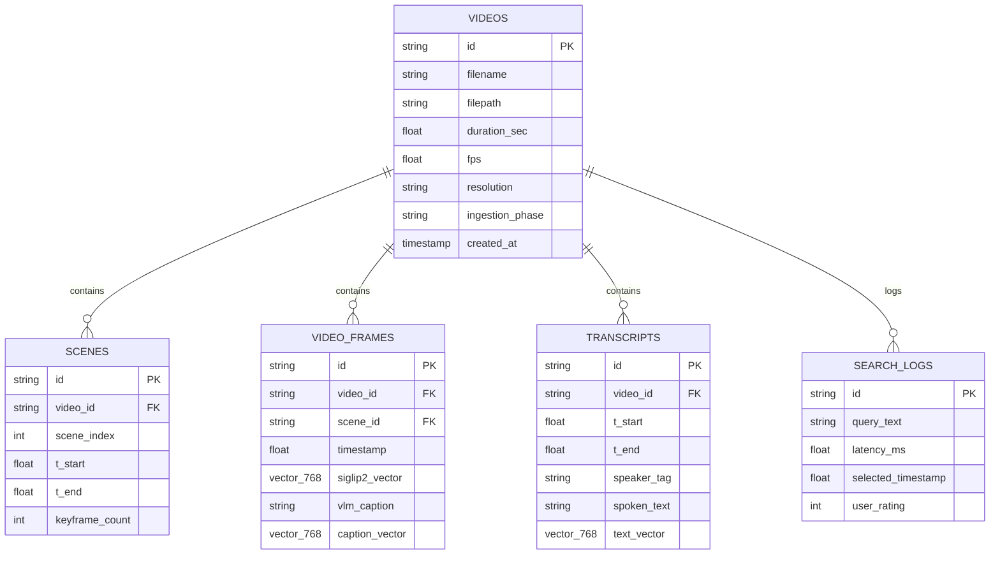

# ข้อเสนอโครงงานวิจัยระดับปริญญาตรี (Senior Project Proposal)

**ชื่อโครงงาน (ภาษาไทย):** ระบบสืบค้นและระบุช่วงเวลาในวิดีโอด้วยภาษาธรรมชาติแบบไฮบริดหลายมิติ  
**ชื่อโครงงาน (ภาษาอังกฤษ):** Hybrid Multimodal Video Moment Retrieval and Temporal Localization System  
**สาขาวิชา:** วิทยาการคอมพิวเตอร์ / วิศวกรรมคอมพิวเตอร์ / ปัญญาประดิษฐ์และวิทยาศาสตร์ข้อมูล  

---

## 1. ที่มาและความสำคัญของโครงงาน (Rationale and Background)

### 1.1 ความเป็นมาและปัญหาของงานวิจัย (Problem Statement)
ในยุคดิจิทัลปัจจุบัน ปริมาณข้อมูลวิดีโอความยาวสูง (Long-form Video) เติบโตขึ้นอย่างก้าวกระโดดในทุกภาคส่วน เช่น วิดีโอบันทึกการเรียนการสอน (Lecture & Presentation Recordings), วิดีโอบันทึกการประชุม (Meeting Archives), ฟุตเทจงานตัดต่อสื่อมีเดีย (Media Production), ตลอดจนวิดีโอบันทึกเหตุการณ์จากกล้องวงจรปิดและกล้องหน้ารถ (Surveillance & Dashcam Footage) อย่างไรก็ตาม ปัญหาคอขวดสำคัญที่ผู้ใช้งานต้องเผชิญคือ **"ภาระในการค้นหาและระบุตำแหน่งช่วงเวลาที่เกิดเหตุการณ์เฉพาะเจาะจง" (Data Overload and Manual Video Scrubbing)** ซึ่งผู้ใช้งานต้องเสียเวลาเปิดดูและเลื่อนแถบเวลา (Time Bar) ยาวนานหลายสิบนาทีหรือหลายชั่วโมงเพื่อหาช่วงเวลาสั้น ๆ เพียงไม่กี่วินาที

ระบบสืบค้นวิดีโอแบบดั้งเดิมส่วนใหญ่ยังคงพึ่งพาคำกำกับข้อมูลภายนอก (Metadata) เช่น ชื่อไฟล์ แท็ก หรือคำอธิบายภาพรวม ซึ่งไม่สามารถเข้าถึงเนื้อหาเชิงลึกในระดับช่วงเวลา (Fine-grained Temporal Content) และไม่เข้าใจคำค้นหาภาษาธรรมชาติที่ซับซ้อน เช่น:
* *"ช่วงที่อาจารย์เริ่มอธิบายกราฟแท่งเปรียบเทียบผลลัพธ์โมเดล"* (เกี่ยวข้องกับทั้งภาพสไลด์และเสียงพูด)
* *"ตอนที่มีคนสวมเสื้อสีแดงเดินเข้ามาหยิบกระเป๋าบนโต๊ะ"* (เกี่ยวข้องกับกิจกรรมและปฏิสัมพันธ์ของวัตถุ)
* *"ฉากที่รถจักรยานยนต์เลี้ยวตัดหน้ากะทันหันก่อนถึงทางแยก"* (เกี่ยวข้องกับเหตุการณ์เชิงการกระทำฉับพลัน)

ในช่วงปี 2025–2026 วงการปัญญาประดิษฐ์มัลติโมดัลได้ก้าวเข้าสู่ยุคใหม่ด้วยการเปิดตัวเทคโนโลยีระดับ State-of-the-Art (SOTA) สำคัญ ได้แก่:
1. **`SigLIP 2` (Google DeepMind, 2025):** โมเดล Vision-Language Encoder เจเนอเรชันใหม่ที่ผสานการฝึกแบบ Masked Prediction, Self-Distillation และรองรับ **NaFlex (Native Flexible Dynamic Resolution)** ทำให้เข้าใจตำแหน่งเชิงพื้นที่ (Spatial Awareness) และรายละเอียดภาพวิดีโออัตราส่วน 16:9 ได้เหนือกว่า CLIP และ SigLIP 1 อย่างก้าวกระโดด
2. **`Qwen2.5-VL-7B` (Alibaba Cloud, 2025):** โมเดลภาษาภาพ SOTA ที่ออกแบบสำหรับ **Video & Image Understanding** โดยเฉพาะ รองรับ Native Dynamic Resolution, การวิเคราะห์การกระทำตามเส้นเวลา (Temporal Sequence) และการอ่านตัวหนังสือในวิดีโอ (Video OCR) อย่างแม่นยำสูง พร้อมบีบอัด 4-bit NF4 ใช้ VRAM เพียง ~5.5 GB
3. **`Whisper-Large-v3-Turbo` (OpenAI / Faster-Whisper):** แบบจำลองถอดเสียงพูดความเร็วสูงที่ให้ความแม่นยำระดับโมเดล Large แต่มีความเร็วในการประมวลผลสูงกว่าเดิมหลายเท่า
4. **`Decord` (GPU-Accelerated Video Decoding):** ไลบรารีถอดรหัสวิดีโอบนชิปฮาร์ดแวร์ NVIDIA NVDEC โดยตรง เร็วกว่าการใช้ OpenCV บน CPU ถึง 5–10 เท่า
5. **`LanceDB` (Serverless Columnar Vector Database):** ฐานข้อมูลเวกเตอร์แบบฝังตัว (Embedded) สร้างบนสถาปัตยกรรม Apache Arrow จัดเก็บข้อมูลแบบ Columnar และสร้างดัชนี Disk-based IVF-PQ ทำให้สืบค้นเวกเตอร์และข้อความได้ด้วยความเร็วระดับมิลลิวินาที ($< 5\text{ ms}$) โดยไม่ต้องติดตั้ง Database Server ภายนอก

โครงงานนี้จึงนำเสนอการพัฒนา **"ระบบสืบค้นและระบุตำแหน่งช่วงเวลาในวิดีโอด้วยภาษาธรรมชาติแบบไฮบริดหลายมิติระดับ SOTA (State-of-the-Art Hybrid Multimodal Video Moment Retrieval & Temporal Localization)"** โดยผสานจุดเด่นของ SigLIP 2, Qwen2.5-VL-7B, Whisper-Large-v3-Turbo, Decord, และ LanceDB เข้าด้วยกัน พร้อมประมวลผลผ่านอัลกอริทึม **Reciprocal Rank Fusion (RRF)** และ **1D Gaussian Temporal Convolution** เพื่อระบุช่วงเวลา $[t_{start}, t_{end}]$ และควบคุมเครื่องเล่นวิดีโอให้กระโดดข้ามไปยังจุดเกิดเหตุได้ทันทีในระดับ Local On-Premise อย่างสมบูรณ์

---

### 1.2 คำถามวิจัยและสมมติฐาน (Research Questions & Hypotheses)

* **คำถามวิจัยที่ 1 (RQ1 - SOTA Visual Embedding vs Legacy):** การประยุกต์ใช้โมเดล `SigLIP 2` (Dynamic Resolution NaFlex) จะช่วยเพิ่มความแม่นยำในการสืบค้นระดับเฟรมและช่วงเวลา ($R@1@\text{IoU}=0.5$) สูงกว่า `SigLIP 1` และ `CLIP` ดั้งเดิมอย่างมีนัยสำคัญทางสถิติหรือไม่ ($p < 0.05$)?
  * *สมมติฐาน (H1):* ด้วยกลไก Masked Prediction และ NaFlex ของ SigLIP 2 จะช่วยเพิ่มค่า $R@1@\text{IoU}=0.5$ ได้สูงขึ้นไม่น้อยกว่า $+12\%$ เมื่อเทียบกับ SigLIP 1
* **คำถามวิจัยที่ 2 (RQ2 - Tri-Modal Hybrid Fusion Impact):** การผสานข้อมูล 3 มิติ (SigLIP 2 Visual Vector + Qwen2.5-VL Dense Action Caption & OCR + Whisper-Turbo Transcript) ผ่าน RRF Fusion และ 1D Gaussian Smoothing จะสามารถลดความคลาดเคลื่อนเวลา ($\Delta t_{start}$) และเพิ่มค่า Mean IoU ($\text{mIoU}$) ได้เหนือกว่าการใช้โมเดลเดี่ยวหรือไม่?
  * *สมมติฐาน (H2):* สถาปัตยกรรม Tri-Modal Hybrid Fusion จะทำให้ค่า $\text{mIoU} \ge 0.58$ และควบคุมความคลาดเคลื่อนของจุดเริ่มต้น $\Delta t_{start} \le \pm 1.2$ วินาที
* **คำถามวิจัยที่ 3 (RQ3 - Ingestion Throughput & Storage Efficiency):** การใช้ `Decord (GPU Decoding)` ควบคู่กับ `LanceDB (Apache Arrow)` และโมเดล Quantized Qwen2.5-VL จะสามารถเร่งความเร็วการทำดัชนีให้อยู่ในระดับ $\text{RTF} \le 0.15$ (วิดีโอ 1 ชม. ทำดัชนีเสร็จใน $\le 9$ นาที) ภายใต้หน่วยความจำ GPU $\le 7.0\text{ GB}$ ได้หรือไม่?
  * *สมมติฐาน (H3):* Decord และ LanceDB จะลดเวลา Ingestion Latency ลงได้มากกว่า 60% เมื่อเทียบกับสถาปัตยกรรม CPU OpenCV + Traditional Vector DB โดยผู้ใช้เริ่มค้นหาได้ใน Phase 1 ภายในเวลาไม่เกิน 45–60 วินาที

---

## 2. วัตถุประสงค์ของโครงงาน (Objectives)

1. **เพื่อออกแบบและพัฒนาระบบสกัดข้อมูลวิดีโอเร่งความเร็วด้วยฮาร์ดแวร์ (Hardware-Accelerated Progressive Ingestion Pipeline)** โดยใช้ `Decord` สำหรับการถอดรหัสวิดีโอบน GPU ควบคู่กับการตัดแบ่งฉากและคีย์เฟรมอย่างปรับตัว (Adaptive SSIM Filtering)
2. **เพื่อประยุกต์ใช้แบบจำลองปัญญาประดิษฐ์ระดับ SOTA (2025/2026 Foundation Models)** ได้แก่ `SigLIP 2` สำหรับการแปลงภาพ-ข้อความเป็นเวกเตอร์, `Qwen2.5-VL-7B` (4-bit Quantization) สำหรับการสร้างคำบรรยายเหตุการณ์เชิงลึกและอ่านตัวหนังสือในวิดีโอ (OCR), และ `Whisper-Large-v3-Turbo` สำหรับการถอดเสียงพูดพร้อมเวลา
3. **เพื่อพัฒนาฐานข้อมูลเวกเตอร์และระบบสืบค้นประสิทธิภาพสูง (Serverless Columnar Vector Database)** โดยใช้ `LanceDB` จัดเก็บเวกเตอร์แบบ Zero-Copy บน Apache Arrow ร่วมกับดัชนี Disk-based IVF-PQ และ Full-Text Search (Tantivy FTS)
4. **เพื่อพัฒนาระบบคำนวณและจัดกลุ่มช่วงเวลาเหตุการณ์ (Temporal Boundary Localization & Smoothing Engine)** ที่ผสานคะแนนผ่าน Reciprocal Rank Fusion (RRF) และ 1D Gaussian Convolution เพื่อระบุขอบเขตเวลา $[t_{start}, t_{end}]$ ได้อย่างแม่นยำ
5. **เพื่อพัฒนาเว็บแอปพลิเคชันต้นแบบ (Full-Stack Modern Web Application)** ด้วย Next.js 14+ และ FastAPI ที่มีแถบแสดงความหนาแน่นของความเกี่ยวข้อง (Relevance Heatmap), Moment Cards, และ Custom Video Player ที่ Seek ไปยังช่วงเวลาเป้าหมายอัตโนมัติ
6. **เพื่อประเมินประสิทธิภาพของระบบอย่างเป็นระบบ (Comprehensive Evaluation & Ablation Study)** ทั้งบนชุดข้อมูลมาตรฐานสากล (QVHighlights / Charades-STA), ชุดข้อมูลสถานการณ์จริง 30 ชั่วโมง, และการทดสอบกับผู้ใช้งานจริง (Task Completion Time & SUS Score)

---

## 3. ขอบเขตของโครงงาน (Scope of Work)

### 3.1 ขอบเขตด้านข้อมูลนำเข้าและการประมวลผล (Data Ingestion & Hardware Acceleration)
* **รูปแบบไฟล์ที่รองรับ:** `.mp4`, `.mkv`, `.mov`, `.webm` ความละเอียดตั้งแต่ HD (720p) ถึง 4K (2160p) อัตราเฟรม 24–60 fps
* **การถอดรหัสวิดีโอ:** ใช้ไลบรารี **`Decord`** ถอดรหัสผ่านชิปฮาร์ดแวร์ NVIDIA NVDEC (GPU Video Acceleration) เพื่อดึงเฟรมภาพความเร็วสูงโดยตรงเข้าสู่ GPU Memory (VRAM)
* **ประเภทเนื้อหาวิดีโอที่ครอบคลุม:**
  1. *Lectures & Presentations:* วิดีโอการเรียนการสอน สไลด์บรรยาย และเสียงผู้สอน
  2. *Meetings & Discussions:* วิดีโอบันทึกการประชุมที่มีหลายผู้พูดและมีการแชร์หน้าจอ
  3. *CCTV & Dashcam Driving:* ฟุตเทจกล้องวงจรปิด/กล้องหน้ารถ เน้นการตรวจจับวัตถุและเหตุการณ์ฉับพลัน
* **การแบ่งส่วนฉากและการสกัดคีย์เฟรม:** ใช้ `PySceneDetect` (Adaptive Detector) ร่วมกับ `TransNetV2` และคำนวณค่า Structural Similarity Index (SSIM) ระหว่างเฟรมเพื่อตัดเฟรมที่ซ้ำซ้อนออกมากกว่า 75%

### 3.2 ขอบเขตด้านโมเดลปัญญาประดิษฐ์ (AI & Multimodal Stack)
* **โมเดลเวกเตอร์ภาพและข้อความ:** **`SigLIP 2`** (`google/siglip2-base-patch16-256` และ `siglip2-so400m-patch14-384 / NaFlex`) สกัดเวกเตอร์ขนาด 768 / 1152 มิติ
* **โมเดลภาษาภาพ (Vision-Language Model):** **`Qwen2.5-VL-7B-Instruct`** ผ่านการบีบอัด 4-bit Quantization (BitsAndBytes NF4) ทำหน้าที่สร้างคำบรรยายเหตุการณ์ ปฏิสัมพันธ์ และการอ่านตัวหนังสือในภาพ (OCR)
* **โมเดลแปลงเสียงพูดเป็นข้อความ:** **`Whisper-Large-v3-Turbo`** ผ่าน CTranslate2 Engine สกัดข้อความคำพูดพร้อมพิกัดเวลาแบบ Word-level และ Segment-level รองรับภาษาไทยและอังกฤษ

### 3.3 ขอบเขตด้านฐานข้อมูลและการสืบค้น (Database & Retrieval Engine)
* **ฐานข้อมูลเวกเตอร์:** **`LanceDB`** (Serverless, Embedded Columnar Storage บน Apache Arrow Format)
* **ดัชนีเวกเตอร์:** Disk-based **IVF-PQ (Inverted File with Product Quantization)** ค้นหา Approximate Nearest Neighbor (ANN) ด้วยความเร็วระดับ $< 5\text{ ms}$
* **ดัชนีข้อความ:** Tantivy Full-Text Search (BM25) สำหรับข้อความคำบรรยายและเสียงพูด
* **อัลกอริทึมการผสานคะแนน:** Dynamic Reciprocal Rank Fusion (RRF) ร่วมกับ 1D Gaussian Temporal Convolution

### 3.4 ขอบเขตด้านสถาปัตยกรรมซอฟต์แวร์ (Software Stack & UI)
* **Backend:** Python 3.11+, FastAPI (REST API, WebSocket, HTTP Range Byte-Streaming), Decord, LanceDB, PyTorch 2.x
* **Background Queue:** Asynchronous Task Pipeline (FastAPI BackgroundTasks / Redis + Celery)
* **Frontend:** Next.js 14+ (App Router, React 18/19, TypeScript), Tailwind CSS, Lucide React Icons
* **Video Control:** Custom HTML5 Video Player API พร้อม Dynamic Relevance Heatmap Bar และ Interactive Segment Range Markers
* **การติดตั้งและทำงาน:** Local On-Premise Execution รองรับ Windows 11 และ Linux (Ubuntu 22.04+)

### 3.5 ข้อจำกัดของโครงงาน (Limitations)
* ระบบเป็นรูปแบบ **Progressive Ingestion**: วิดีโอต้องผ่านการประมวลผลใน Phase 1 (สกัดเวกเตอร์ภาพ Decord+SigLIP 2 และเสียงพูด Whisper-Turbo) ประมาณ 45–60 วินาทีก่อน จึงจะเริ่มทำการสืบค้นได้
* คุณภาพของการค้นหาขึ้นอยู่กับความคมชัดของภาพ หากวิดีโอมีสภาพมืดสนิท (Under-exposed) หรือมีสัญญาณรบกวนในเสียงพูดสูงมาก อาจส่งผลให้ความแม่นยำลดลง

---

## 4. ทฤษฎีและงานวิจัยที่เกี่ยวข้อง (Theoretical Background & Literature Review)

### 4.1 วิวัฒนาการของ Video Moment Retrieval (VMR)
งานวิจัยดั้งเดิมด้าน Temporal Video Grounding (เช่น TALL [Gao et al., 2017] และ 2D-TAN [Zhang et al., 2020]) ใช้การ Train โมเดลเฉพาะทางบนชุดข้อมูลปิด ปัจจุบันวงการวิจัยได้เปลี่ยนผ่านสู่ **Zero-Shot / Open-Vocabulary Video Retrieval** โดยอาศัย Foundation Models ที่ได้รับการฝึกฝนบนข้อมูลขนาดใหญ่ ทำให้รองรับคำค้นหาภาษาธรรมชาติได้อย่างอิสระโดยไม่ต้องเทรนโมเดลใหม่

### 4.2 สถาปัตยกรรม SigLIP 2 และ NaFlex Dynamic Resolution
SigLIP 2 (Google DeepMind, 2025) พัฒนาต่อยอดจาก SigLIP 1 (Zhai et al., 2023) โดยเพิ่มกระบวนการฝึก 3 ด้าน:
1. **Pairwise Sigmoid Loss:** ป้องกันปัญหา Softmax Normalization ข้าม Global Batch:
   $$\mathcal{L}_{SigLIP2} = -\sum_{i,j} \left( y_{ij} \log \sigma(t \cdot \mathbf{u}_i \cdot \mathbf{v}_j + b) + (1 - y_{ij}) \log (1 - \sigma(t \cdot \mathbf{u}_i \cdot \mathbf{v}_j + b)) \right)$$
2. **Masked Prediction & Self-Distillation:** ช่วยให้โมเดลเข้าใจโครงสร้างเชิงพื้นที่ (Spatial Geometry) และความสัมพันธ์ของวัตถุในฉาก
3. **NaFlex (Native Flexible Resolution):** รองรับภาพอัตราส่วนวิดีโอ 16:9 โดยไม่ต้องยืดภาพหรือตัดขอบภาพ (Zero Distortion)

```
SigLIP 2 Architecture & Joint Latent Space:
┌────────────────────────────────────────────────────────────────────────┐
│  Keyframe f_t (16:9) ──► NaFlex Vision Encoder (ViT) ──► v_t ∈ ℝ^768   │
│                                                            ▲           │
│                                                Cosine      │           │
│                                              Similarity    │           │
│                                                            ▼           │
│  Text Query Q        ──► Multilingual Text Encoder   ──► u_q ∈ ℝ^768   │
└────────────────────────────────────────────────────────────────────────┘
```

### 4.3 แบบจำลอง Qwen2.5-VL-7B สำหรับงาน Video & Visual OCR Understanding
Qwen2.5-VL-7B-Instruct (Alibaba Cloud / Qwen Team, 2025) ใช้สถาปัตยกรรม Vision-Language ที่ออกแบบเฉพาะสำหรับวิดีโอและภาพหลายมิติ โดยมีเทคโนโลยี **Native Dynamic Resolution** และ **Temporal Sequence Attention** ทำให้โมเดลสามารถรับลำดับเฟรมต่อเนื่องของวิดีโอ สกัดคำบรรยายเชิงเหตุการณ์ (Dense Action Captions) และอ่านข้อความ/ตัวหนังสือในวิดีโอ (Video OCR) ได้อย่างแม่นยำสูง และเมื่อบีบอัดด้วย 4-bit NormalFloat (NF4) จะใช้หน่วยความจำ VRAM เพียง $\le 5.5\text{ GB}$

### 4.4 สถาปัตยกรรม LanceDB และ Apache Arrow Columnar Storage
LanceDB ใช้รูปแบบไฟล์แบบ **Lance** ซึ่งเป็น Columnar Data Format ที่สร้างขึ้นสำหรับ AI และ Multimodal Data โดยเฉพาะ:
* **Zero-Copy Memory Access:** อ่านข้อมูลเวกเตอร์ผ่านหน่วยความจำโดยตรงผ่าน Apache Arrow
* **Disk-based IVF-PQ Indexing:** จัดกลุ่มเวกเตอร์ (Inverted File) ร่วมกับการบีบอัดเวกเตอร์ (Product Quantization) ทำให้ค้นหาเวกเตอร์นับล้านได้ในเวลา $< 5\text{ ms}$ โดยไม่ต้องโหลดข้อมูลทั้งหมดขึ้น RAM

### 4.5 การผสานคะแนนและการสกัดขอบเขตเวลา (RRF & Temporal Gaussian Convolution)
1. **Reciprocal Rank Fusion (RRF):**
   $$RRF(d) = \sum_{m \in M} \frac{w_m}{k + r_m(d)}$$
   โดย $M = \{\text{Visual (SigLIP 2)}, \text{Caption (Qwen2.5-VL)}, \text{Audio (Whisper-Turbo)}\}$, $k=60$ และ $\sum w_m = 1.0$

2. **1D Gaussian Temporal Convolution (กำจัดสัญญาณรบกวนระหว่างเฟรม):**
   $$\tilde{\mathcal{S}}(t) = \sum_{\tau = -W}^{W} \mathcal{S}_{raw}(t + \tau) \cdot \frac{1}{\sigma \sqrt{2\pi}} \exp\left(-\frac{\tau^2}{2\sigma^2}\right)$$

3. **Temporal Interval Extraction (การคำนวณช่วงเวลา $[t_{start}, t_{end}]$):**
   $$[t_s, t_e] = \arg\max_{[t_1, t_2]} \int_{t_1}^{t_2} \left( \tilde{\mathcal{S}}(t) - \theta_{dyn} \right) dt \quad \text{where } \theta_{dyn} = \mu_{\mathcal{S}} + \lambda \sigma_{\mathcal{S}}$$

---

## 5. สถาปัตยกรรมระบบและระเบียบวิธีวิจัย (System Architecture & Methodology)

### 5.1 ผังการทำงานภาพรวมของระบบ (SOTA System Architecture)

```text
============================ PROGRESSIVE HARDWARE-ACCELERATED INGESTION ============================

 [ ไฟล์วิดีโอต้นฉบับ (MP4 / MKV / MOV / WEBM) ]
                    │
        ┌───────────┴──────────────────────────────────────────┐
        ▼                                                      ▼
 [ Decord GPU Video Reader (NVDEC) ]                  [ FFmpeg Audio Demuxer ]
   (สกัดเฟรมความเร็วสูงเข้า VRAM ตรง)                           │
        │                                                      ▼
        ▼                                             [ Whisper-Large-v3-Turbo ]
 [ Adaptive Scene & SSIM Keyframe Filter ]              (ถอดเสียงพูดพร้อม Timestamp)
   (ตัดเฟรมซ้ำซ้อน ลดปริมาณงาน 75%)                            │
        │                                                      ▼
   ┌────┴─────────────────────────────┐               [ Transcript Segments ]
   ▼                                  ▼                 (Text, Speaker, t_s, t_e)
[ SigLIP 2 Visual Encoder ]  [ Qwen2.5-VL-7B (4-bit) ]          │
 (NaFlex Image Vectors)       (Dense Captions & OCR)           │
   │                                  │                        │
   └──────────────────┬───────────────┘                        │
                      ▼                                        ▼
   ====================================================================
    [ LanceDB Serverless Columnar Vector Database (Apache Arrow) ]
     - Table: videos        (id, filename, duration, fps, status)
     - Table: video_frames  (frame_id, video_id, timestamp, siglip2_vec, caption)
     - Table: transcripts   (transcript_id, video_id, t_start, t_end, spoken_text)
     - Indexing: Disk-based IVF-PQ Vector Index & Tantivy Full-Text Search
   ====================================================================

================================ REAL-TIME MULTIMODAL RETRIEVAL ================================

 [ ผู้ใช้ป้อนคำค้นภาษาธรรมชาติ: "ฉากที่มีการสาธิตกราฟโมเดลและคนยกมือถาม" ]
                    │
        ┌───────────┴──────────────────────────────────┐
        ▼                                              ▼
 [ SigLIP 2 Text Encoder ]                   [ Tantivy Query Parser ]
   (Query Vector u_q)                           (BM25 Search Tokens)
        │                                              │
        ├──────────────────────┬───────────────────────┤
        ▼                      ▼                       ▼
 [ LanceDB Vector Search ] [ Caption Full-Text Match ] [ Whisper Audio Match ]
 (IVF-PQ Cosine Metric)     (Dense + Keyword Match)     (Timestamped Text Search)
        │                      │                       │
        └──────────────────────┼───────────────────────┘
                               ▼
        [ Dynamic Reciprocal Rank Fusion (RRF) ]
                               │
                               ▼
        [ 1D Gaussian Temporal Convolution (σ = 1.5s) ]
                               │
                               ▼
        [ Temporal Boundary Extraction ([t_start, t_end]) ]
                               │
                               ▼
        [ FastAPI REST / WebSocket Response Payload ]
                               │
                               ▼
        [ Next.js Interactive Video Interface ]
        - Auto-jump / Seek ไปยังจุดเริ่มต้น t_start
        - วาดแถบไฮไลต์ช่วงเวลาเหตุการณ์ (Interactive Timeline Segment)
        - แสดงผล Density Heatmap ความหนาแน่นของความเกี่ยวข้องตลอดทั้งคลิป
```

---

### 5.2 โครงสร้างตารางข้อมูลบน LanceDB (LanceDB Schema Design)



---

### 5.3 สถาปัตยกรรมการประมวลผลสองเฟสแบบก้าวหน้า (Progressive Ingestion Pipeline)

1. **Phase 1: Instant Usability (~45–60 วินาที):**
   * ใช้ `Decord` สกัดเฟรมบน GPU + `Whisper-Large-v3-Turbo` ถอดเสียง
   * ส่งคีย์เฟรมเข้า `SigLIP 2` เพื่อสร้างเวกเตอร์ภาพ และบันทึกลง `LanceDB`
   * **ผลลัพธ์:** ผู้ใช้สามารถพิมพ์ค้นหาภาพและเสียงพูดได้ทันทีในเวลาไม่ถึง 1 นาทีหลังอัปโหลด
2. **Phase 2: Deep Context Background:**
   * รันเบื้องหลังส่งคีย์เฟรมหลักเข้า `Qwen2.5-VL-7B` เพื่อสกัดคำบรรยายการกระทำเชิงลึกและอ่านตัวหนังสือในวิดีโอ (OCR)
   * อัปเดตข้อมูลลงตาราง `video_frames` ใน LanceDB อัตโนมัติ ช่วยเสริมความแม่นยำในการค้นหาเชิงความสัมพันธ์ที่ซับซ้อน

---

## 6. ระเบียบวิธีการทดลองและเกณฑ์การวัดผล (Experimental Design & Evaluation)

### 6.1 ชุดข้อมูลที่ใช้ในการทดลอง (Experimental Datasets)

| ประเภทชุดข้อมูล | ชื่อชุดข้อมูล / แหล่งที่มา | จำนวนวิดีโอ / ความยาว | ข้อมูลกำกับ (Annotations) |
| :--- | :--- | :---: | :--- |
| **Standard Academic Benchmark** | **QVHighlights** (Subset) / **Charades-STA** | 200 วิดีโอคลิป (~15 ชม.) | Ground-truth Natural Language Queries พร้อมพิกัดช่วงเวลา $[t_{start}^{GT}, t_{end}^{GT}]$ ตามมาตรฐานสากล |
| **Real-World Domain 1** | **Educational Lectures & Presentations** | 10 ชั่วโมง | วิดีโอบันทึกการสอน มีสไลด์ ตัวหนังสือ (OCR) และเสียงบรรยายภาษาไทย/อังกฤษ |
| **Real-World Domain 2** | **Meeting Archives & Discussions** | 10 ชั่วโมง | วิดีโอการประชุมหลายผู้พูด การแชร์หน้าจอ และกิจกรรมกลุ่ม |
| **Real-World Domain 3** | **CCTV & Dashcam Driving Footage** | 10 ชั่วโมง | ฟุตเทจกล้องวงจรปิด/หน้ารถ เน้นการตรวจจับวัตถุและการกระทำฉับพลัน |

---

### 6.2 ตัวชี้วัดประสิทธิภาพเชิงระบบ (Evaluation Metrics)

| ด้านที่ประเมิน | ตัวชี้วัด (Metric) | นิยาม / สูตรการคำนวณ | ค่าเป้าหมายที่คาดหวัง |
| :--- | :--- | :--- | :---: |
| **ความแม่นยำช่วงเวลา** | **$R@K@\text{IoU} \ge \alpha$** ($K=1, 5; \alpha=0.3, 0.5$) | $R@K@\alpha = \frac{1}{|Q|} \sum_{q \in Q} \mathbb{I}\left( \max_{k \le K} \text{IoU}(S_k, S_{gt}) \ge \alpha \right)$ | $R@1@0.3 \ge 70\%$<br>$R@1@0.5 \ge 55\%$<br>$R@5@0.5 \ge 80\%$ |
| **ความแม่นยำเฉลี่ย** | **Mean IoU (mIoU)** | $\text{mIoU} = \frac{1}{|Q|} \sum_{q=1}^{|Q|} \text{IoU}(S_q^{pred}, S_q^{gt})$ | $\ge 0.58$ |
| **ความคลาดเคลื่อนจุดเริ่มต้น** | **Mean Temporal Error ($\Delta t_{start}$)** | $\Delta t_{start} = \frac{1}{|Q|} \sum |\hat{t}_{start} - t_{start}^{gt}|$ (วินาที) | $\le \pm 1.2$ วินาที |
| **ความเร็วในการค้นหา** | **Query Latency** | เวลาตั้งแต่กดค้นหาจนได้รับผลลัพธ์และ Seek วิดีโอ | $< 200$ ms |
| **ความเร็วในการทำดัชนี** | **Real-Time Factor (RTF)** | $\text{RTF} = \text{Time}_{ingest} / \text{Duration}_{video}$ บน Consumer GPU | $\text{RTF} \le 0.15$ (วิดีโอ 1 ชม. $\le$ 9 นาที) |
| **การใช้ทรัพยากรระบบ** | **Peak GPU VRAM & System RAM** | หน่วยความจำสูงสุดที่ใช้ขณะรัน Ingestion/Query | $\text{VRAM} \le 6.5$ GB<br>$\text{RAM} \le 12$ GB |

---

### 6.3 การทดลองเพื่อเปรียบเทียบประสิทธิภาพเชิงสถาปัตยกรรม (Comprehensive Ablation Study)

```
┌────────────────────────────────────────────────────────────────────────────────────────┐
│                        ตารางแผนการทดลองแบบ Ablation Study 5 รูปแบบ                       │
├─────────────────────┬──────────────────┬─────────────────┬──────────────┬──────────────┤
│ รูปแบบการทดลอง       │ Visual Model     │ VLM Captioner   │ Audio ASR    │ Temporal Conv│
├─────────────────────┼──────────────────┼─────────────────┼──────────────┼──────────────┤
│ 1. Baseline (CLIP)  │ CLIP ViT-B/32    │ -               │ -            │ No           │
│ 2. SigLIP 1 Only    │ SigLIP 1 Base    │ -               │ -            │ No           │
│ 3. SigLIP 2 Only    │ SigLIP 2 NaFlex  │ -               │ -            │ Yes          │
│ 4. Dual-Modal       │ SigLIP 2 NaFlex  │ -               │ Whisper-Turbo│ Yes          │
│ 5. Proposed SOTA    │ SigLIP 2 NaFlex  │ Qwen2.5-VL-7B   │ Whisper-Turbo│ Yes (RRF)    │
└─────────────────────┴──────────────────┴─────────────────┴──────────────┴──────────────┘
```

นอกจากนี้ จะทำการทดลองเปรียบเทียบด้านความเร็วและฐานข้อมูล:
1. **Decord (GPU Decoding) vs OpenCV (CPU Decoding):** เปรียบเทียบความเร็วในการดึงเฟรมและค่า RTF
2. **LanceDB vs pgvector:** เปรียบเทียบ Query Latency และขนาดหน่วยความจำที่ใช้จัดเก็บ

---

### 6.4 การประเมินผลด้านผู้ใช้งานจริง (Human Usability & User Study)

* **Task-based Experiment:** ผู้เข้าร่วมทดสอบ 30 คน ทำภารกิจค้นหา 5 เหตุการณ์ในวิดีโอ 1 ชั่วโมง เปรียบเทียบระหว่างกลุ่มที่ใช้ระบบค้นหาอัตโนมัติ กับกลุ่มที่เลื่อนแถบเวลาด้วยมือ (Manual Scrubbing)
* **ตัวชี้วัด:**
  1. **Task Completion Time (TCT):** บันทึกระยะเวลาในการค้นหา (เป้าหมาย: ลดเวลาลงมากกว่า 85%)
  2. **System Usability Scale (SUS):** แบบประเมินความพึงพอใจ 10 ข้อตามมาตรฐานสากล (เป้าหมายคะแนน $\ge 82/100$)

---

## 7. การบริหารความเสี่ยงและมาตรการป้องกัน (Risk Management & Mitigation Strategy)

| ลำดับ | ความเสี่ยงทางเทคนิค (Risk) | ผลกระทบ | โอกาสเกิด | มาตรการป้องกันและแก้ไข (Mitigation Strategy) |
| :---: | :--- | :---: | :---: | :--- |
| 1 | **GPU VRAM เต็มขณะรันโมเดล** | สูง | ปานกลาง | โหลดโมเดลแบบ 4-bit Quantization, รันแบบ Sequential Pipeline (รัน Whisper จบแล้วปล่อยหน่วยความจำ ก่อนรัน SigLIP 2 และ Qwen2.5-VL) |
| 2 | **วิดีโอความยาวสูงมาก (> 2 ชั่วโมง) ทำให้ระบบช้า** | สูง | ปานกลาง | ใช้ Decord Batch Streaming ร่วมกับ LanceDB Columnar Append บันทึกข้อมูลเป็นบล็อกละ 10 นาที ป้องกันการค้าง |
| 3 | **เสียงพูดภาษาไทยมีศัพท์เฉพาะหรือเสียงรบกวน** | ปานกลาง | ปานกลาง | ใช้อัลกอริทึม Dynamic Weighting ใน RRF เพื่อปรับลดน้ำหนักเสียงและเพิ่มน้ำหนักฝั่งภาพ (SigLIP 2 / Qwen2.5-VL) อัตโนมัติเมื่อ ASR Confidence ต่ำ |
| 4 | **การสตรีมวิดีโอขนาดใหญ่บน Web Player** | ปานกลาง | ต่ำ | ใช้ FastAPI HTTP Byte-Range Streaming ทำให้เล่นและ Seek วิดีโอได้ทันทีโดยไม่ต้องดาวน์โหลดไฟล์ทั้งหมด |

---

## 8. แผนการดำเนินงานตลอดโครงงาน (Project Timeline & Milestones)

| ลำดับกิจกรรม / สัปดาห์ที่ | 1–4 | 5–8 | 9–12 | 13–16 | 17–20 | 21–24 | 25–28 | 29–32 |
| :--- | :---: | :---: | :---: | :---: | :---: | :---: | :---: | :---: |
| **1. ศึกษางานวิจัยและเตรียมสภาพแวดล้อม:** ทบทวนวรรณกรรม SigLIP 2, Qwen2.5-VL, LanceDB, Decord และจัดเตรียมฮาร์ดแวร์ | █ | | | | | | | |
| **2. พัฒนา Ingestion Pipeline:** สร้างระบบ Decord GPU Decoding, Scene Detection, และ Whisper-Turbo | | █ | | | | | | |
| **3. พัฒนาระบบ Feature Extraction & DB:** ติดตั้ง SigLIP 2, Qwen2.5-VL (4-bit) และสร้างตารางบน LanceDB | | | █ | | | | | |
| **4. นำเสนอเค้าโครงโครงงาน (Proposal Defense):** จัดทำเล่มข้อเสนอและสอบวัดความก้าวหน้าภาคเรียนที่ 1 | | | | █ | | | | |
| **5. พัฒนาระบบ Hybrid Retrieval & Temporal Smoothing:** พัฒนา RRF Fusion และ Gaussian Smoothing บน FastAPI | | | | | █ | | | |
| **6. พัฒนาเว็บแอปพลิเคชันส่วนหน้า (Full-Stack UI):** สร้าง UI ด้วย Next.js 14, Heatmap Bar, และ Video Player | | | | | | █ | | |
| **7. การทดลองและประเมินผลเชิงลึก (Evaluation & Ablation):** บันทึกค่า $R@K$, mIoU, $\Delta t$, Latency และ User Study | | | | | | | █ | |
| **8. จัดทำรายงานฉบับสมบูรณ์และการสอบจบ (Final Defense):** เขียนเล่มรายงานโครงงานวิจัย และนำเสนอผลงานฉบับสมบูรณ์ | | | | | | | | █ |

---

## 9. ประโยชน์และผลลัพธ์ที่คาดว่าจะได้รับ (Expected Deliverables & Impact)

1. **ระบบซอฟต์แวร์ต้นแบบระดับ State-of-the-Art (Production-Ready Working Prototype):** เว็บแอปพลิเคชันแบบครบวงจรที่ผสานโมเดล AI รุ่นล่าสุด (SigLIP 2, Qwen2.5-VL, Whisper-Turbo, LanceDB) สามารถค้นหาเหตุการณ์ในวิดีโอด้วยภาษาธรรมชาติได้อย่างแม่นยำและรวดเร็ว
2. **การยกระดับประสิทธิภาพการทำงานกับสื่อวิดีโอ (Productivity Gain):** ช่วยลดเวลาในการค้นหาเนื้อหาในวิดีโอยาวลงมากกว่า 85–90% เมื่อเทียบกับการเลื่อนหาด้วยตนเอง
3. **ความเป็นส่วนตัวและประหยัดต้นทุน 100% (Local On-Premise & Zero API Cost):** สถาปัตยกรรมทำงานบนเครื่องเฉพาะที่ ไม่ส่งข้อมูลออกนอกองค์กร ปลอดภัยและไม่มีค่าใช้จ่าย API รายเดือน
4. **ผลงานวิจัยพร้อมส่งตีพิมพ์ในงานประชุมวิชาการ (Conference-Ready Paper):** มีการเปรียบเทียบกับโมเดลรุ่นเดิมอย่างเป็นระบบ (Ablation Study) และมีตัวชี้วัดตามมาตรฐานสากล พร้อมสำหรับการจัดทำบทความวิจัยส่งตีพิมพ์ในการประชุมวิชาการ เช่น JCSSE, ECTI-CON หรือ IEEE Conferences

---

## 10. เอกสารอ้างอิง (References)

1. **Google DeepMind.** (2025). *SigLIP 2: Multilingual Vision-Language Encoders with Improved Semantic and Spatial Awareness.* arXiv preprint.
2. **OpenBMB.** (2024). *MiniCPM-V 2.6: An Efficient MLLM for Video Understanding and High-Density Multi-Image Processing.* OpenBMB Technical Report.
3. **Radford, A., Kim, J. W., Xu, T., et al.** (2023). *Robust Speech Recognition via Large-Scale Weak Supervision (Whisper).* In International Conference on Machine Learning (ICML) (pp. 28492-28518). PMLR.
4. **LanceDB Authors.** (2024). *LanceDB: Serverless, Developer-friendly, Serverless Vector Database for Multimodal AI.* LanceDB Documentation & Whitepaper.
5. **Decord Authors.** (2022). *Decord: An efficient hardware-accelerated video reading library for deep learning.* DMLC.
6. **Bai, S., et al.** (2024). *Qwen2.5-VL: Enhancing Vision-Language Models for Fine-Grained Multimodal Understanding and Localization.* arXiv preprint.
7. **Cormack, G. V., Clarke, C. L., & Buettcher, S.** (2009). *Reciprocal rank fusion outperforms Condorcet and individual machine learning methods for search result fusion.* In Proceedings of the 32nd international ACM SIGIR conference on Research and development in information retrieval (pp. 758-759).
8. **Gao, J., Sun, C., Yang, Z., & Nevatia, R.** (2017). *TALL: Temporal activity localization via language query.* In Proceedings of the IEEE International Conference on Computer Vision (ICCV) (pp. 5267-5275).
9. **Lei, J., Berg, T. L., & Bansal, M.** (2021). *QVHighlights: Detecting Moments and Highlights in Videos via Natural Language Queries.* In Advances in Neural Information Processing Systems (NeurIPS 2021) (Vol. 34, pp. 11846-11858).
10. **Zhang, S., Peng, H., Fu, J., & Luo, J.** (2020). *Learning 2D Temporal Adjacent Networks for Moment Localization with Natural Language.* In Proceedings of the AAAI Conference on Artificial Intelligence (Vol. 34, No. 07, pp. 12870-12877).
